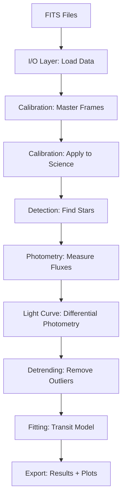

# Architecture & Design

**pyTransitPhotometry System Architecture**

---

## Table of Contents

1. [System Overview](#system-overview)
2. [Data Flow Pipeline](#data-flow-pipeline)
3. [Module Architecture](#module-architecture)
4. [Key Abstractions](#key-abstractions)
5. [Dependency Graph](#dependency-graph)
6. [Design Patterns](#design-patterns)
7. [State Management](#state-management)
8. [Error Handling Strategy](#error-handling-strategy)

---

## System Overview

### Architectural Style

**pyTransitPhotometry** follows a **pipeline architecture** pattern, where data flows sequentially through stages:

```
Raw FITS → Calibration → Detection → Photometry → Light Curve → Detrending → Fitting → Results
```

Each stage is:
- **Stateless**: Operates on inputs, produces outputs, no global state
- **Composable**: Can be executed independently or chained together
- **Testable**: Clear input/output contracts enable unit testing
- **Replaceable**: Swap implementations (e.g., different photometry backends)

### Three-Layer Architecture

```
┌─────────────────────────────────────────────────────────────┐
│                    PRESENTATION LAYER                        │
│  - CLI (cli.py): Command-line interface                     │
│  - Visualization (visualization.py): Plotting               │
├─────────────────────────────────────────────────────────────┤
│                     BUSINESS LOGIC LAYER                     │
│  - Pipeline (pipeline.py): Orchestration                    │
│  - Calibration, Detection, Photometry, etc.: Algorithms     │
├─────────────────────────────────────────────────────────────┤
│                  DATA ACCESS LAYER                           │
│  - I/O (io.py): FITS loading, CSV export                   │
│  - Config (config.py): YAML parsing, validation             │
└─────────────────────────────────────────────────────────────┘
```

**Why This Structure?**
- **Separation of Concerns**: UI changes don't affect algorithms
- **Reusability**: Core algorithms usable from Python scripts or notebooks
- **Testability**: Each layer can be mocked/tested independently

---

## Data Flow Pipeline

### Stage-by-Stage Execution



### Data Structures at Each Stage

| Stage | Input | Output | Key Structures |
|-------|-------|--------|----------------|
| **I/O** | FITS files (on disk) | `np.ndarray` (3D), `list[dict]` (headers) | Raw pixel arrays, metadata dicts |
| **Calibration** | Raw science frames | `np.ndarray` (3D, calibrated) | `CalibrationFrames` object, master bias/dark/flat |
| **Detection** | Single 2D image | `astropy.table.Table` | Source catalog: x, y, flux, sharpness, roundness |
| **Photometry** | Image + source positions | `dict` per star | `{'flux': float, 'flux_err': float, 'snr': float, ...}` |
| **Light Curve** | Multi-frame photometry | `dict` | `{'times': ndarray, 'fluxes': ndarray, 'errors': ndarray}` |
| **Detrending** | Raw light curve | Cleaned light curve | Same structure, filtered data |
| **Fitting** | Detrended light curve | Fit result `dict` | `{'rp': (value, err), 'a': (value, err), ...}` |
| **Export** | All results | Files on disk | CSV, JSON, PNG plots |

### Intermediate State Storage

The `TransitPipeline` class stores intermediate results as instance attributes:

```python
class TransitPipeline:
    def __init__(self, config):
        self.calibration_frames = None  # CalibrationFrames object
        self.science_data = None        # Raw science frames
        self.headers = None              # FITS headers
        self.calibrated_images = None   # After calibration
        self.sources_list = None         # Detected stars per frame
        self.lightcurve = None           # Differential photometry
        self.detrended_lc = None         # After outlier removal
        self.fit_result = None           # Transit fit parameters
```

**Why?**
- Enables stage-by-stage execution: `pipeline.run_calibration()`, then `pipeline.run_detection()`
- Allows inspection between stages: `pipeline.calibrated_images[0]` to examine first frame
- Supports partial pipeline runs for debugging

---

## Module Architecture

### Directory Structure

```
pyTransitPhotometry/
├── __init__.py          # Public API exports
├── pipeline.py          # Orchestrator (TransitPipeline class)
├── config.py            # Configuration management
│
├── calibration.py       # CCD correction algorithms
├── detection.py         # Star finding (DAOStarFinder wrapper)
├── photometry.py        # Aperture photometry
├── lightcurve.py        # Differential photometry
├── detrending.py        # Outlier removal, systematics tests
├── models.py            # Transit fitting (batman integration)
│
├── io.py                # FITS I/O, CSV export
├── visualization.py     # Matplotlib plotting
└── cli.py               # Command-line interface
```

### Module Responsibilities

#### 1. **pipeline.py** — The Orchestrator
**Role:** Coordinates execution of all stages  
**Key Class:** `TransitPipeline`  
**Responsibilities:**
- Load configuration and create output directory
- Execute stages in correct order
- Store intermediate results
- Handle stage failures gracefully
- Print progress updates

**Design Pattern:** **Facade Pattern**  
Hides complexity of individual modules behind simple interface:
```python
pipeline = TransitPipeline(config)
results = pipeline.run()  # One call executes entire pipeline
```

#### 2. **config.py** — Configuration Management
**Role:** Parse, validate, and provide access to user settings  
**Key Classes:**
- `PipelineConfig`: Top-level config
- `PathConfig`, `CalibrationConfig`, etc.: Nested configs

**Design Pattern:** **Dataclasses for Strong Typing**
```python
@dataclass
class PhotometryConfig:
    aperture_radius: float = 6.0
    annulus_inner: float = 40.0
    # ...
```

**Why Dataclasses?**
- Type hints enable IDE autocomplete
- Default values documented in code
- Easy conversion to/from YAML

#### 3. **calibration.py** — CCD Physics
**Role:** Implement standard CCD reduction equation  
**Key Functions:**
- `create_master_frame()`: Combine bias/dark/flat frames
- `scale_dark_frame()`: Exposure-time scaling
- `calibrate_image()`: Apply full calibration

**Algorithm:**
```python
calibrated = (raw - bias - dark_scaled) / flat_normalized
```

**Key Class:** `CalibrationFrames`  
Container for master frames with validation:
```python
class CalibrationFrames:
    def __init__(self, bias, dark, flat, ...):
        self._validate_shapes()  # Ensure consistent dimensions
```

#### 4. **detection.py** — Source Finding
**Role:** Wrap photutils DAOStarFinder with quality filters  
**Key Functions:**
- `detect_sources()`: Find stars above threshold
- `filter_sources()`: Apply sharpness/roundness cuts
- `select_reference_stars()`: Choose comparison stars

**Why Wrap?**
- Consistent API across different detection backends
- Automatic sorting by brightness
- Built-in quality metrics interpretation

#### 5. **photometry.py** — Flux Measurement
**Role:** Extract background-subtracted flux with uncertainties  
**Key Functions:**
- `measure_flux()`: Core photometry routine
- `optimize_aperture_radius()`: SNR maximization
- `refine_centroid()`: Sub-pixel positioning

**Physics:** CCD Noise Model
```python
noise² = Poisson(signal + sky) + Npix × σ_sky²
SNR = signal / noise
```

#### 6. **lightcurve.py** — Differential Photometry
**Role:** Build time series from multi-frame photometry  
**Key Class:** `LightCurveBuilder`  
**Algorithm:**
```python
ratio = target_flux / weighted_reference_flux
ratio_err = ratio × sqrt((σ_target/target)² + (σ_ref/ref)²)
```

**Why Differential Photometry?**
Dividing by reference stars cancels:
- Atmospheric extinction variations
- Telescope tracking errors
- Thin cloud passages

#### 7. **detrending.py** — Systematic Removal
**Role:** Clean light curve before fitting  
**Key Functions:**
- `sigma_clip()`: Iterative outlier rejection
- `test_airmass_correlation()`: Diagnostics
- `remove_linear_trend()`: Linear detrending

**Statistical Method:** Robust MAD-based sigma clipping
```python
scatter = 1.4826 × MAD  # Convert MAD to σ for normal distribution
outliers = |flux - median| > 3σ
```

#### 8. **models.py** — Transit Fitting
**Role:** Interface to batman transit model + optimization  
**Key Class:** `TransitFitter`  
**Algorithm:**
```python
model = batman_transit_model(times, rp, a, inc, ...)
popt, pcov = curve_fit(model, times, fluxes, ...)
```

**Physical Constraints:** Bounded optimization prevents unphysical solutions

#### 9. **io.py** — Data Access
**Role:** Abstract file I/O from algorithms  
**Key Functions:**
- `load_fits_files()`: Directory → NumPy arrays
- `extract_header_value()`: Parse FITS keywords
- `export_lightcurve()`, `export_fit_results()`: Write outputs

**Why Abstraction?**
- Easy to swap FITS library (currently astropy)
- Centralized error handling for missing files
- Consistent logging/progress bars

#### 10. **visualization.py** — Plotting
**Role:** Generate publication-quality figures  
**Key Functions:**
- `plot_calibration_comparison()`: Before/after images
- `plot_detected_sources()`: Star positions overlay
- `plot_lightcurve()`: Time series with error bars
- `plot_transit_fit()`: Data + model + residuals

**Design:** All plots accept `save_path` for batch processing

#### 11. **cli.py** — Command-Line Interface
**Role:** Enable non-Python users to run pipeline  
**Entry Point:** `pytransit` command (defined in `setup.py`)  
**Features:**
- Argument parsing (config file, output directory)
- Stage selection (`--stages calibration detection`)
- Example config creation (`--create-config`)

---

## Key Abstractions

### 1. Configuration as First-Class Object

Instead of passing 10+ parameters to every function:

```python
# Bad: Parameter explosion
def run_photometry(aperture_radius, annulus_inner, annulus_outer, 
                   optimize, radii_test, weighting, ...):
    pass

# Good: Config object encapsulates related parameters
def run_photometry(config: PhotometryConfig):
    aperture = config.aperture_radius
    # ...
```

**Benefits:**
- Reduces function signatures
- Groups related parameters
- Enables validation (e.g., `aperture_radius > 0`)

### 2. Source Table as Standardized Interface

All detection methods return `astropy.table.Table` with fixed columns:
```python
sources.colnames = ['id', 'xcentroid', 'ycentroid', 'flux', 
                    'sharpness', 'roundness', ...]
```

**Why?**
- Swappable detection backends (SExtractor, sep, custom)
- Consistent downstream code (photometry doesn't know detection method)
- Standard astronomical data structure

### 3. Photometry Result Dictionary

Every `measure_flux()` call returns:
```python
{
    'flux': float,
    'flux_err': float,
    'snr': float,
    'background_mean': float,
    'background_std': float,
    'aperture_sum': float,
    'centroid': (x, y)
}
```

**Contract:**
- Always includes flux and flux_err (required for error propagation)
- Optional metadata (background, SNR) for diagnostics
- Consistent return type simplifies light curve construction

### 4. Light Curve Dictionary

Standard structure for time series:
```python
{
    'times': np.ndarray,        # Observation times
    'fluxes': np.ndarray,       # Normalized flux ratios
    'errors': np.ndarray,       # Flux uncertainties
    'target_fluxes': np.ndarray,      # Raw target flux
    'reference_fluxes': np.ndarray,   # Raw reference flux
    'centroids': np.ndarray,          # (x, y) per frame
    'valid_frames': np.ndarray        # Boolean mask
}
```

**Why?**
- Detrending, plotting, and fitting all expect same keys
- `valid_frames` tracks which frames passed quality checks
- Metadata (centroids, raw fluxes) available for diagnostics

---

## Dependency Graph

### Module Dependencies (Import Hierarchy)

```
Level 0 (No internal dependencies):
    io.py                (depends only on numpy, astropy)
    config.py            (depends only on yaml, dataclasses)

Level 1 (Depends on Level 0):
    calibration.py       (uses io for FITS loading)
    detection.py         (uses io for metadata)
    visualization.py     (standalone plotting)

Level 2 (Depends on Level 1):
    photometry.py        (uses detection results)
    models.py            (standalone, batman wrapper)

Level 3 (Depends on Level 2):
    lightcurve.py        (uses photometry results)
    detrending.py        (uses lightcurve structure)

Level 4 (Orchestration):
    pipeline.py          (uses all modules)
    cli.py               (uses pipeline)
```

**Key Insight:** Low coupling between modules. Only `pipeline.py` knows about all stages.

### External Dependencies

```python
# Core numerical/scientific:
numpy              # Array operations
scipy              # Optimization (curve_fit)
astropy            # FITS I/O, astronomical data structures

# Specialized:
photutils          # DAOStarFinder, aperture photometry
batman-package     # Transit model computation

# Utilities:
matplotlib         # Plotting
pyyaml             # Configuration parsing
pandas             # CSV export (optional, could use np.savetxt)
```

**Dependency Strategy:**
- **Minimal required dependencies**: Only numpy, scipy, astropy, photutils, batman
- **Optional enhancements**: matplotlib (visualization), pandas (export)
- **Avoid bleeding-edge versions**: Specify `>=1.20` not `>=2.0` for broader compatibility

---

## Design Patterns

### 1. **Facade Pattern** (pipeline.py)

**Intent:** Provide simple interface to complex subsystem

```python
# User sees:
pipeline = TransitPipeline(config)
results = pipeline.run()

# Behind the scenes:
pipeline.run_calibration()    # Calls calibration.py functions
pipeline.run_detection()      # Calls detection.py functions
# ... 6 more stages
```

### 2. **Strategy Pattern** (weighting methods)

**Intent:** Swap algorithms at runtime

```python
# User configures:
photometry:
    reference_weighting: "inverse_variance"  # or "equal"

# Code selects:
if weighting == "inverse_variance":
    weights = 1.0 / ref_errs**2
elif weighting == "equal":
    weights = np.ones(len(ref_fluxes))
```

**Extensibility:** Add new weighting schemes without modifying core code

### 3. **Builder Pattern** (LightCurveBuilder)

**Intent:** Construct complex object step-by-step

```python
builder = LightCurveBuilder(target_index=2, reference_indices=[0, 1])
lc = builder.build(images, sources, photometry_func, time_extractor)
```

Separates light curve configuration from construction logic.

### 4. **Template Method Pattern** (detrending)

**Intent:** Define skeleton of algorithm, let subclasses override steps

```python
def detrend_lightcurve(lc, config):
    # Step 1: Sigma clipping (always)
    lc_clipped = sigma_clip(lc, ...)
    
    # Step 2: Linear trend removal (optional)
    if config.remove_linear_trend:
        lc_clipped = remove_linear_trend(lc_clipped)
    
    # Step 3: Airmass test (optional)
    if config.test_airmass:
        test_airmass_correlation(airmass, lc_clipped)
    
    return lc_clipped
```

Users override steps via config, not code modification.

### 5. **Dataclass Pattern** (config.py)

**Intent:** Strong typing with minimal boilerplate

```python
@dataclass
class DetectionConfig:
    fwhm: float = 5.0
    threshold: float = 10000.0
    # Type hints + defaults in one place
```

### 6. **Dependency Injection** (pipeline stages)

**Intent:** Pass dependencies explicitly, avoid global state

```python
# Bad:
def measure_flux(image, position):
    config = global_photometry_config  # Hidden dependency!

# Good:
def measure_flux(image, position, aperture_radius, annulus_inner, ...):
    # All dependencies explicit in signature
```

---

## State Management

### No Global State

**Design Rule:** All state lives in:
1. **Config objects** (user-provided parameters)
2. **Function arguments** (data flowing through pipeline)
3. **Return values** (results)
4. **Pipeline instance attributes** (intermediate storage)

**Why?**
- Eliminates side effects: `f(x)` always produces same output for given `x`
- Thread-safe: Run multiple pipelines in parallel
- Testable: No setup/teardown of global state

### Pipeline Instance State

```python
class TransitPipeline:
    def __init__(self, config):
        self.config = config
        # All state initialized to None
        self.calibrated_images = None
        self.sources_list = None
        # ...
    
    def run_calibration(self):
        # Compute and store
        self.calibrated_images = calibrate(...)
    
    def run_detection(self):
        # Depends on previous stage
        if self.calibrated_images is None:
            raise RuntimeError("Run calibration first")
        self.sources_list = detect(self.calibrated_images, ...)
```

**Pattern:** Each `run_*` method:
1. Checks if prerequisites are available
2. Computes results
3. Stores in instance attributes
4. Returns results (optional)

### Immutability Where Possible

```python
# Detrending returns NEW arrays, doesn't modify input
def sigma_clip(times, fluxes, errors):
    mask = compute_outliers(fluxes)
    return times[mask], fluxes[mask], errors[mask], mask
```

**Benefits:**
- Original data preserved for comparison
- Easier debugging (inspect before/after)
- Prevents accidental mutations

---

## Error Handling Strategy

### 1. **Validate Early** (config.py)

```python
class PipelineConfig:
    def validate(self):
        if not Path(self.paths.data_dir).exists():
            raise FileNotFoundError(f"Data directory not found: {self.paths.data_dir}")
        
        if self.photometry.aperture_radius <= 0:
            raise ValueError("aperture_radius must be positive")
```

**Philosophy:** Fail fast with clear error message before wasting compute time

### 2. **Informative Exceptions**

```python
# Bad:
raise ValueError("Invalid parameter")

# Good:
raise ValueError(
    f"aperture_radius ({aperture_radius}) must be smaller than "
    f"annulus_inner ({annulus_inner}). Aperture cannot overlap background region."
)
```

### 3. **Graceful Degradation** (light curve construction)

```python
for i, frame in enumerate(frames):
    try:
        flux = measure_flux(frame, position)
    except Exception as e:
        print(f"⚠ Frame {i}: {e}, skipping")
        valid_frames[i] = False
        continue
```

**Trade-off:** Skip bad frames instead of aborting entire pipeline

### 4. **Warnings for Non-Critical Issues**

```python
if len(bias_frames) < 5:
    warnings.warn("Only {len(bias_frames)} bias frames. 5+ recommended for robust statistics.")
```

**When to Warn vs. Error:**
- Error: Cannot proceed (missing files, invalid parameters)
- Warning: Can proceed but results may be suboptimal

### 5. **Contextual Error Messages**

```python
try:
    popt, pcov = curve_fit(...)
except RuntimeError as e:
    raise RuntimeError(
        f"Transit fit failed: {e}\n"
        f"Suggestions:\n"
        f"  - Check t0_guess is close to actual transit time\n"
        f"  - Widen parameter bounds if fit hits limits\n"
        f"  - Verify light curve shows clear transit signal"
    )
```

---

## Summary: Architectural Strengths

1. **Modularity**: Each stage is independent, testable unit
2. **Configuration-Driven**: All decisions explicit in YAML
3. **Type Safety**: Dataclasses + type hints catch errors early
4. **Clear Contracts**: Standardized data structures between stages
5. **Fail-Fast**: Validation at pipeline start prevents late failures
6. **Observability**: Progress logging and diagnostics at each stage
7. **Extensibility**: Strategy pattern enables swapping algorithms
8. **No Surprises**: Explicit dependencies, no global state, immutable data

**Next:** See [API_REFERENCE.md](API_REFERENCE.md) for detailed function documentation.
